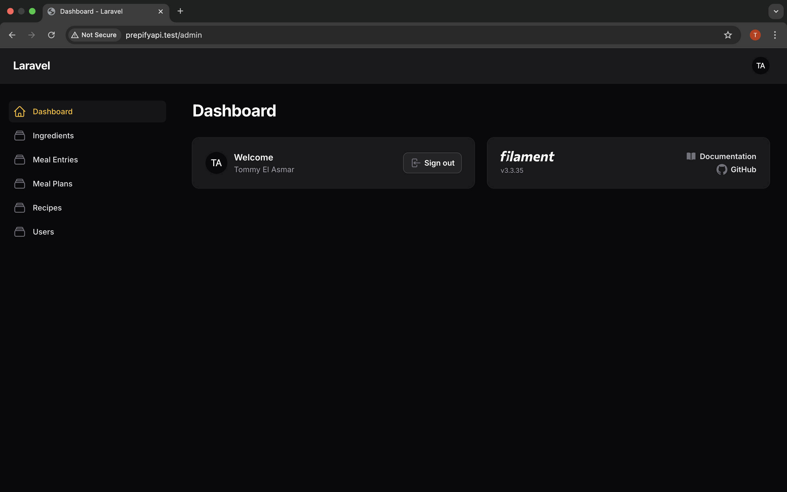
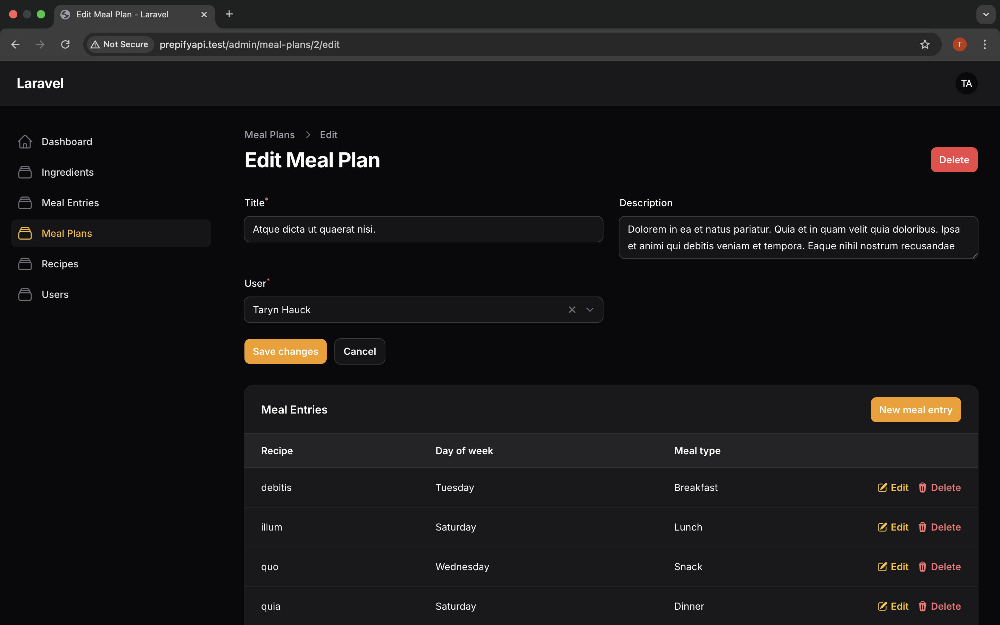
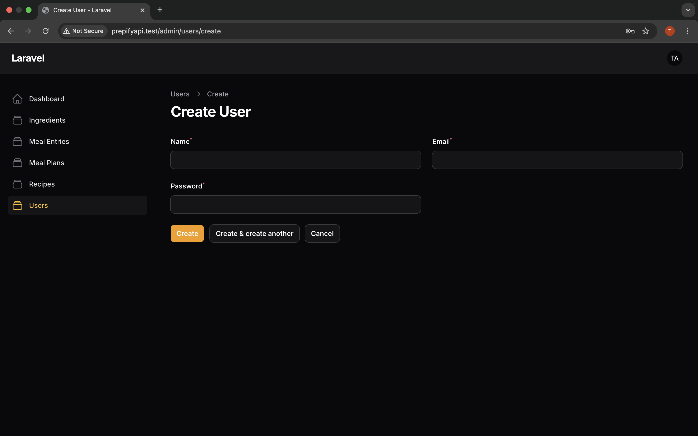

# 🥗 Prepify API

**Prepify** is a Laravel RESTful API for managing users, meal plans, recipes, ingredients, and meal entries. It includes authentication, authorization, and an admin dashboard built using Filament.

---

## 🚀 Features

-   ✅ User authentication via Laravel Sanctum
-   ✅ CRUD for:
    -   Meal Plans
    -   Recipes (with ingredients)
    -   Ingredients
    -   Meal Entries
-   ✅ Public access to view content
-   ✅ Protected routes for user-specific actions (create/update/delete)
-   ✅ Filament admin dashboard
-   ✅ Database seeding & testing with Postman

---

## 🧑‍💻 Tech Stack

-   Laravel 10
-   PHP 8+
-   Sanctum (for API auth)
-   Filament (admin UI)
-   SQLite or MySQL
-   Postman

---

## 📂 Project Structure

prepify-api/
├── app/
│ └── Http/Controllers/
│ └── Models/
│ └── Filament/Resources/
├── database/
│ └── migrations/
│ └── factories/
│ └── seeders/
├── docs/
│ ├── project-proposal.pdf
│ ├── erd.drawio
│ └── erd.png
├── postman/
│ └── prepify-api.postman_collection.json
├── screenshots/
│ ├── dashboard.png
│ ├── recipes.png
│ └── meal-plans.png
├── README.md

---

## 🔐 Authentication

| Action                | Auth Required |
| --------------------- | ------------- |
| Register              | ❌            |
| Login                 | ❌            |
| Logout                | ✅            |
| View Recipes          | ❌            |
| Create/Edit Recipes   | ✅            |
| View Meal Plans       | ❌            |
| Create/Edit MealPlans | ✅            |
| Ingredient CRUD       | ❌            |

---

## 📮 API Endpoints

> Import Postman Collection:
> [`prepify-api.postman_collection.json`](./postman/prepify-api.postman_collection.json)

Example:

```http
POST /api/register
POST /api/login
GET  /api/recipes
POST /api/recipes     (requires token)
```

# 🔑 To access protected routes, log in via `/api/login` to get a token, then include it in headers:

Use Bearer Token:
Authorization: Bearer your_token_here

## 🧪 Seeder Data

Run this to create sample data:
php artisan migrate:fresh --seed

This seeds:
• Users (5)
• Recipes (50)
• Ingredients (at least 100+)
• Meal Plans with entries and meal types

## 🎛 Admin Panel (Filament)

Access Filament admin panel at:
http://prepifyAPI/admin

You can manage:
• Users
• Recipes
• Meal Plans
• Meal Entries
• Ingredients

## 📸 Screenshots

### Admin Dashboard



### Recipes Management


### Meal Plans Management



### User Management



## 📝 Documentation

### Project Proposal

📄 [Project Proposal (DOCX)](./docs/PrepifyAPI%20proposal.docx)

### ERD (draw.io)


## ⚙️ Setup Instructions

git clone https://github.com/your-username/prepify-api.git
cd prepify-api

composer install
cp .env.example .env
php artisan key:generate

# Configure DB in .env (SQLite/MySQL)

php artisan migrate --seed

php artisan serve

# If using Filament

php artisan filament:install --panels

## 👨‍💻 Author

Tommy El Asmar
Built with Laravel, Filament, and a cup of coffee.
